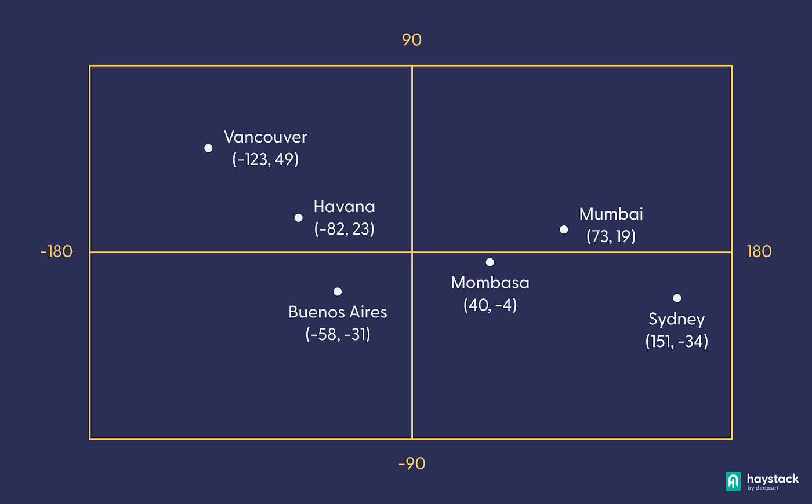
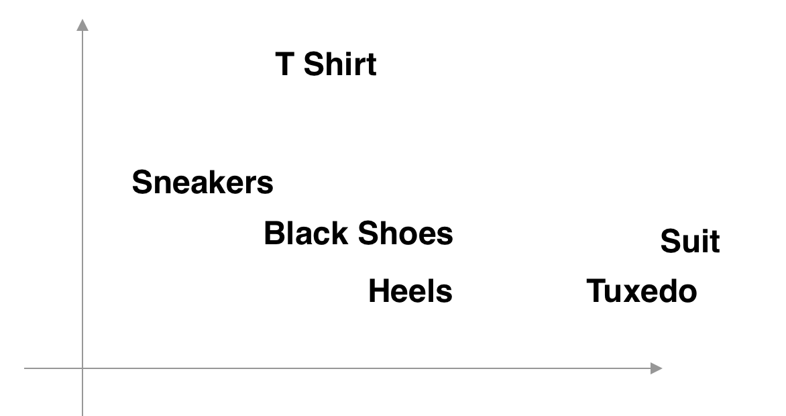
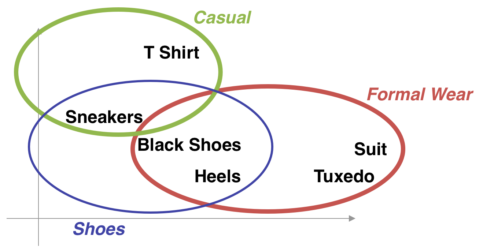
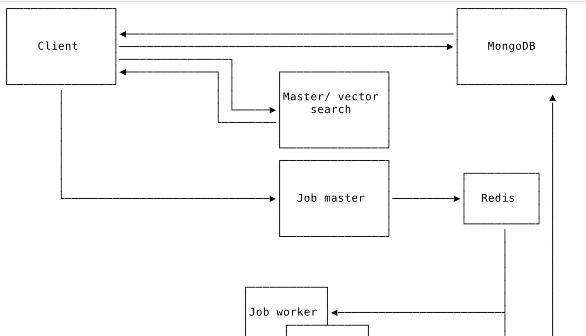

# Seamless Semantic Image Search in MongoDB for E-Commerce

## Introduction


Thanks to recent advancements in AI, adding the cutting-edge capability of "semantic search" to your e-commerce site has never been easier. This is made possible by SuperDuperDB's effective integration of open-source libraries with MongoDB. You can take a closer look [here](blog_version_multimodal_image_search_clip.ipynb). .

Semantic search trumps traditional keyword search, which is infamous for its high maintenance costs and often subpar user experience. Keyword search generally requires users to guess the precise terms used for catalog labeling. For instance, a search for "sneakers" may yield no results if the items were labeled as "running shoes."

By leveraging SuperDuperDB and the open-source model CLIP from OpenAI, you can embed semantic search capabilities into your store with fewer than 100 lines of Python code.

But this is just the beginning. SuperDuperDB's utility in e-commerce extends beyond just semantic search. It simplifies other aspects, like personal shopper recommendations and dynamic price setting. There are easy database integrations for model fine-tuning based on APIs like HuggingFace Transformers, PyTorch, sklearn, and OpenAI.

## What Is Semantic Search?

Imagine a scenario where a user visits an online shop intending to buy sneakers. Should they navigate to "Casual shoes" or "Sports shoes" categories?

Let's consider a real-world [example](https://www.kaggle.com/datasets/vikashrajluhaniwal/fashion-images) from a fashion e-commerce product catalog. This catalog boasts 3000 images of apparel and footwear, divided by categories. Interestingly, sneakers are present in both categories. This means a user would have to conduct two searches to view all the sneakers available.


It happens very often that the user is searching for a keywords that is a synonym, but not quite the Quite often, users search using synonyms of the product labels used in the catalog. So, how about a search mechanism that understands the underlying meaning, or 'semantics', of the user's query? This is precisely the idea behind "semantic search."

Using SuperDuperDB and CLIP, we can extract all sneaker options in response to a simple text query, "sneakers."


It seems that the search engine has understood the concept "sneakers" even though there is no such tag in the product catalogue. How does it work under the hood?

At its core, semantic search represents every concept as an array of numbers, otherwise known as a "vector" or "embedding." For instance, the concept "sneakers" can be expressed as a 512-dimensional vector. We can assign vectors to both words and images.


**Sneakers** &#8594;

|   |   |   |   |
|---|---|---|---|
| 0.1 | 5.6 | ... | 7.7 | 
| #1   | #2   | ... | #512 | 


 &#8594;

|   |   |   |   |
|---|---|---|---|
| 0.2 | 5.3 | ... | 7.8 | 
| #1   | #2   | ... | #512 | 


What does this space of "meanings" look like? While it's challenging to visualize a 512-dimensional space, we can simplify it by comparing it to familiar 2-dimensional vectors, such as (latitude, longitude) coordinates on Earth's surface.

(Image is from [this](https://medium.com/deepset-ai/the-beginners-guide-to-text-embeddings-a3330bf9f8cd) great explanation of text embeddings
TODO: ask for permission to use.)




If we know vectors of two cities, then we can compute the distance we need to travel from one to another, "as the crow flies". The cities that are close together are usually in the same country, speak the same language and are quite similar in other ways.  So we can guess how similar the cities are just from their latitude and longitude.

That is exactly how semantic search finds concepts that have close meaning - they look for vectors that are close to each other. And in 512 dimensional space, we don't use latitude and longitude, in fact it is very rare that, say, dimension #12 has any meaning.

There is a technique called t-SNE that can create an easy-to-understand 2-dimensional view from a more complicated multi-dimensional space.

This is our product catalog. "Sneakers" are close to a "T-Shirt". "Suit" is close to "tuxedo" as they are quite similar. And far away from "T-shirt" as they are worn in different circumstances.





You can see groups of similar concepts together. One concept can be in two clusters - for example, "Sneakers" are both in the shoes and casual wear clusters. 


We can assign the meaning vectors not just to words, but also to images.


## What is CLIP?

In this guide, we utilize a powerful semantic search model called CLIP, developed and open-sourced by OpenAI as a [Python package](https://github.com/openai/CLIP). It is freely available, unlike some of OpenAI's proprietary APIs like ChatGPT.

CLIP's strength lies in its ability to create meaning vectors.  It is a deep learning model that learned from millions of image descriptions gathered from the web. OpenAI has collected pairs image plus its alt-text. The model was trained to make sure that the
two vectors the image and its alt-text stay close together, and at the same time that other images and alt-texts are farther apart.

With SuperDuperDB, you can easily fine-tune CLIP on your own product catalog. Stay tuned for more on this in upcoming blog posts.


(image from <https://www.pinecone.io/learn/series/image-search/clip/>)

## Overcoming Technical challenges

You might be thinking now that OpenAI has done the arduous task of pioneering deep learning advancements, we can just grab it and deploy it in our online store, correct?

Well, the reality is, there are still some technical hurdles to overcome:

- Consolidating all images in a single location.
- Running the model to generate vectors for all existing images in the catalog.
- Automating the vector generation for new images as they are added to the catalog.
- Identifying products with vectors similar to a text search query.
- Integrating these results into the website's frontend code.

The usual way to do this is to setup a AWS Cloudformation templates to pre-process the images, run CLIP on them. All of this needs to be orchestrated via AirFlow DAG and added to the pipeline for adding new data.

To find similar vectors you will need to setup a new service - a vector database. There are plenty of them to choose from. Just choosing one might take a lot of time in the current landscape.

The backend search API endpoint needs to have a new workflow for serving a request. A text comes in, it is converted to a vector with CLIP, then a query is sent to the vector database to find ids of products similar vectors, and then these ids need to be retrieved from the product catalog and served back.

## SuperDuperDB Simplifies The Process

With SuperDuperDB, you can overcome these technical challenges in under 100 lines of code, as demonstrated [here](../../notebooks/blog_version_multimodal_image_search_clip.ipynb).

To achieve this we:

- store images as binary data in MongoDB;
- get image vectors from CLIP, parallelized via Dask
- store vectors in a vector database, LanceDB
- create a watcher thread that watches the database for new images and automatically generate vectors for them 

(**TODO:** this diagram is just a placeholder, make a smaller and more concise architecture diagram: Mongo, Lance, inference thread.)


### Store images in MongoDB

We start by taking the images from a dataset on disk and storing them in MongoDB.

By the way, getting to a stage of "dataset on disk" or "data in S3 bucket" might not be so easy, as they can be in many different places and micro-services. SuperDuperDB has easy ways to retrieve and process a remote resource URI. (**TODO**: link to docs or code ) (**TODO:** Duncan, in the notebook, is there a way to make URIs and encoders play together so that URI is downloaded and encoded? Now i first read the image from disk and then encode it, It would be nice to demo it here if it is possible)


In the below code snippet, we take an image from the dataset and encode it into a binary object for convenient storage in MongoDB.

Below is a code snippet that converts an image from the dataset into a binary object for efficient storage in MongoDB. We create a SuperDuperDBDocument object to facilitate the storage of complex data types in a database through Encoders — be it images, audio files, PyTorch tensors, or vector embeddings. Here, we use an encoder for images - ``image_encoder``.

Next, we insert the documents into MongoDB using insert_many. Our image_encoder is provided as an argument to...  [TODO: how is it used? I suspect it is for reading but couldn't find explicit mention. ]

(**TODO**: maybe make naming convention more aligned in the repo - camelcase or underscores, Document or pil_image )

```python
from superduperdb.core.document import Document as SuperDuperDocument

from superduperdb.encoders.pillow.image import pil_image as image_encoder

sdp_documents = [SuperDuperDocument({'image': image_encoder(r['image'])}) for r in dataset]

db.execute(collection.insert_many(sdp_documents, encoders=(image_encoder,)))
```

For  data inspection, you can use [MongoDB Compass](https://www.mongodb.com/try/download/compass), a user-friendly desktop UI. This is one of the many advantages of working within the MongoDB ecosystem.


# Create Semantic Vectors of Images and Text

 We now employ CLIP to assign "meaning" vectors to our product catalog and to the queries.
 ```python
import torch
import clip

from superduperdb.encoders.torch.tensor import tensor as tensor_encoder
from superduperdb.models.torch.wrapper import TorchModel

my_tensor_encoder = tensor_encoder(torch.float, shape=(512,))

model, preprocess = clip.load("ViT-B/32", device='cpu')
```

 I chose a popular version of the CLIP neural network architecture - "ViT-B/32" as it is not too slow, and also provides good enough results. "ViT" stands for Visual Transformer, the neural network architecture used. "B" stands for "model of default(Base) depth". There are several depths that CLIP can be and they define the size of the model. For example, L(for Large) is the next in size and it is much larger and slower to run. "32" means that the model reads the image in small patches of 32 x 32 pixels at a time. There are also steps in image pre-processing (resizing, adjusting brightness, contrast) and text tokenization (converting words into sub-words and their vectors).

I deliberately don't go into much detail about what all these parameters mean as this is not where the value lays for having a great semantic search in your shop. Changing "ViT-Base/32" to "ViT-Huge/14" or changing text tokenizer to Roberta might improve things, but it will also complicate them. The main improvement for your shop will come from fine-tuning CLIP on your own images, specific to your domain. That gives real improvements even on a small model. SuperDuperDB makes this fine-tuning easy to execute - more in an up-coming blog post.

 
```python

text_model = TorchModel(
 identifier='clip_text',
 object=model,
 preprocess=lambda x: clip.tokenize(x)[0],
 forward_method='encode_text',
 encoder=my_tensor_encoder
)

visual_model = TorchModel(
 identifier='clip_image',
 preprocess=preprocess,
 object=model.visual,
 encoder=my_tensor_encoder,
)
```

We load the model to run on a CPU via PyTorch, using a SuperDuperDB encoder for easy database storage. This encoder is designed for the semantic vectors that come as 512-dimensional PyTorch arrays or `tensors``.

We deploy two different models - one to get a vector for a text, like "sneakers". And another to extract the meaning vector from an image of sneakers.  

```python
from superduperdb.core.vector_index import VectorIndex
from superduperdb.core.watcher import Watcher

db.add(
    VectorIndex(
        'my-index',
        indexing_watcher=Watcher(
            model=visual_model,
            key='image',
            select=collection.find(),
        ),
        compatible_watcher=Watcher(
            model=text_model,
            key='text',
            active=False,
        )
    )
)
```

Next, we create semantic vectors for every image in our product catalog, an offline process given the extensive nature of most catalogs.

By adding the `visual_model` as a SuperDuperDB watcher, we ensure automatic generation of vectors for new images as they are added to the collection. This watcher thread continuously scans the database for new data.

We also incorporate a text query system for the image database via a `compatible_watcher` that uses `text_model`. The watcher is set to `active=False` because we don't need to index the catalog images with the text model, as it is solely for incoming text search queries.

The different modalities of image and text are blended in this vector index, earning the name "multi-modal search". This is the "meaning space" we discussed in the introduction.

The model output is stored in MongoDB, with each model run stored in the _outputs field of the input document. Future versions will track and version each model run, so stay tuned.

```json
{
  "_id": {
    "$oid": "64c23c9ad761f1b1ca002444"
  },
  "image": {
    "_content": {
      "bytes": {
        "$binary": {
          "base64": "iVBORw0KGgo...",
          "subType": "00"
        }
      },
      "encoder": "pil_image"
    }
  },
  "_fold": "train",
  "_outputs": {
    "image": {
      "clip_image": {
        "_content": {
          "bytes": {
            "$binary": {
              "base64": "vyc7vEK/nL4oM...",
              "subType": "00"
            }
          },
          "encoder": "torch.float32[512]"
        }
      }
    }
  }
}
```


## Searching The Catalog

The following code snippet showcases how to search the 'Footwear' category in your product catalog for images similar to the term "sneakers".  It is used to run the demo in this [notebook](blog_version_multimodal_image_search_clip.ipynb). 

```python
    db = pymongo.MongoClient().documents
    db = superduper(db)

    collection = Collection(name='fashion-images')
    cursor = collection
        
    similar_doc = SuperDuperDocument({'text':'sneakers'})
    cursor = cursor.find({'Category': 'Footwear'}).like(similar_doc, vector_index='my-index', n=20)
        
    results = db.execute(cursor)

```

If you're a Python Mongo developer, you'll recognize the familiar PyMongo `find` API call here. SuperDuperDB allows the combination of this with the semantic search similarity function, `like`, while preserving all PyMongo features. In this instance, we first filter the Footwear section of the catalog using MongoDB's efficient data querying, then run a computationally expensive similarity search on this data subset.

Furthermore, results behave just like PyMongo query results.

(**TODO**: Duncan, what are some other noteworthy features of the API?)


## Serving To The Front-End

If you are already using the  [FARM Web-stack](https://www.mongodb.com/developer/languages/python/farm-stack-fastapi-react-mongodb/) (FastAPI, React, and MongoDB),  you can easily incorporate this code in FastAPI and serve it as seen in this[demo](https://github.com/weaviate/weaviate-examples/tree/main/clip-multi-modal-text-image-search)

 (**TODO:** build analogue to this Weaviate FastApi React demo but with superduperDB,  show model confidence, add new image upload capability.)


We're also developing a REST API that allows SuperDuperDB's vector index to work seamlessly with other web backends, such as Node.js or no-code Web frameworks like Bubble.

(**TODO:** question to you: is it actually the roadmap? :) ).

## Upcoming Blog Post: Model Training and Comparisons

In my upcoming blog post, I'll explore how to enhance search functionality for your specific e-commerce store.

For instance, suppose you run a specialized store that sells candles. While the standard CLIP model can distinguish between a candle and a candlestick, it can't differentiate between "tea light" and "pillar" candles.

With SuperDuperDB, you can easily train CLIP on your data with just a few lines of code. Depending on your image count, this training might take a couple of days on a GPU. To justify this time and cost, you'll want to ensure that your training code is efficient and bug-free. Here using an open-source solution like SuperDuperDB, gives more confidence. The open code has many eyes on it but people using it, and is built on the expertise of the maintainers who used this approach in commercial projects over the years.

SuperDuperDB also simplifies model comparisons on identical data.

To illustrate the ease of qualitative comparison between two models using SuperDuperDB, we've added two vector indices to the same MongoDB, searched them concurrently, and compared the results in a Gradio UI [here](../../notebooks/compare_multimodal_image_search_clip_openclip.ipynb) . The two models have the same CLIP architecture, but one was trained by OpenAI on their closed-source dataset and the other on the open-source [LAION 2B](https://huggingface.co/laion/CLIP-ViT-B-32-laion2B-s34B-b79K).
(**TODO:** change to ecommerce example)


## Conclusion

SuperDuperDB provides an efficient and streamlined way to improve the search experience on your e-commerce platform. It enables you to transition from manual tagging to a more precise and intuitive semantic search, leveraging the power of CLIP models and MongoDB. This brings about new opportunities, such as presenting your users with more relevant search results, while reducing the burden of maintaining manual tags in your product catalog.

But the versatility of SuperDuperDB extends beyond merely enhancing image search. It offers seamless integration with MongoDB-based web stacks, provides utilities for comparing and testing models, and even supports model training for a more personalized, tailored search experience.

The future of e-commerce search isn't limited to keyword matching. It's about comprehending the user's intent and delivering the most pertinent results. And with SuperDuperDB, that future is within your grasp.

Semantic search is just the tip of the iceberg when it comes to SuperDuperDB's utility in e-commerce. It can work with sklearn models to classify new products, determining which section of the catalog they should be assigned to based on their CLIP image vectors, or even use OpenAI embeddings of their descriptions.

Stay tuned for our next blog post where we will delve deeper into training and comparing models to further customize and enhance your e-commerce platform's search experience.


